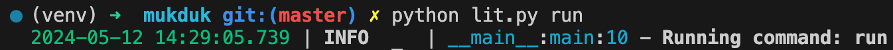
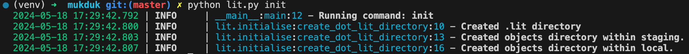
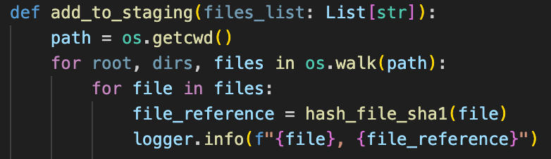
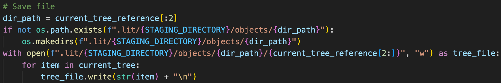
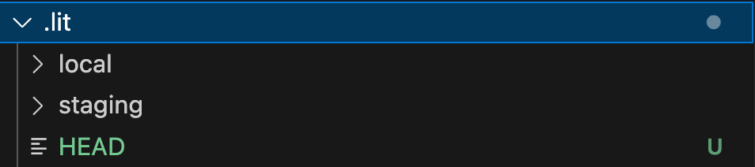
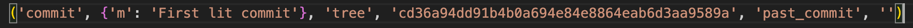

# Building Git from Scratch in Python

It is a classic Tuesday afternoon. Your morning stand-up went by like a breeze, you got away with saying basically nothing, finished the work you said you'd do for tomorrow within an hour, and then pissed about for the rest of the day. It's now 4:30pm and time to get your updates to GitHub, create a PR, and sign off. Easy.

`git add .`

Nailed it.

`git commit -m "Add code."`

Child's play.

`git push origin main`

Uh oh....

`error: failed to push some refs to 'https://github.com/Rick-Astley/Will-I-give-up'`

Ah that's fine, I'll just pull the changes and push again.

`git pull`

Triggering. A conflict. <br>

Which prick has been touching my stuff. Damn it Alan, I told you to leave my code alone! <br>

Right, resolved that. Let's commit and push again.

`error: failed to push some refs to 'https://github.com/Rick-Astley/Never'`

<p align="center">
    
</p>

According to Reddit, unknown, random, nonsense git issues are a right of passage for many programmers. After a while you get the hang of it, merging becomes second nature, you learn about `reflog`, and sometimes, to feel like a baller you do a force push. But do you actually know what's going on underneath the hood? How is git actually storing all of my files? What even is all this crap in `.git`?

Well that's what I was wondering and since I have no friends or social life, I decided to build git from scratch in Python.


## How Does it Actually Work?

So I actually have no idea how git works, so where do you turn when you have no idea about something? That's right, random people on YouTube. The [first video](https://www.youtube.com/watch?v=lG90LZotrpo&t=396s&ab_channel=CS50) I watched was by John Britton as part of a CS50 Talk on Git Internals and it was incredible. He walked through each stage of the git process in detail, showing exactly what each of the main commands were doing. First up `git init`.

The beginning of any git tutorial is always a `git init`, but what does it actually do. Well if we open a new repo and enter `git init`, we can find out.

<p align="center">
    
</p>

Cool, so `git init` adds a `.git` directory, which subsequently holds a bunch of stuff that I have no idea about, but it's a start!. They all seem pretty empty.  What do these folders actually do? Well, apparently this is where everything happens, this is git. Using the `tree {folder}` command to view the whole directory, we can see how `.git` changes as we begin adding and commiting files. What's the first thing that people normally add to a repo and then immediately ignore? That's right, a `README.md`.

Here's what the `.git` directory looks like when we add and commit a file. The key folder to look out for is `.git/objects`:

<br>

<!-- <p align="center">
    <div style="display: inline-block; width: 30%; text-align: center;">
        <p><strong>Before</strong></p>
        
    </div>
    <div style="display: inline-block; width: 30%; text-align: center; margin-left: 1%; margin-right: 1%;">
        <p><strong>Add README</strong></p>
        
    </div>
    <div style="display: inline-block; width: 30%; text-align: center;">
        <p><strong>Commit README</strong></p>
        
    </div>
</p> -->

Before | Add README | Commit README
:---:|:---:|:---:
 |  | 

<br>

Brilliant.

So what the hell are these? Well, as the doctor said to me during my rectal examination, let's have a look inside and see. We can use the `git cat-file {filename}` command. The `{filename}` here includes the two character folder that the file is in, and usefully, we only have to write out the first several characters. Let's use it on the first file that was made, e69de29.

<p align="center">
    
</p>

Well that was useless.

Or was it?! If you remember, the `README.md` file we created was actually empty, so having e69de29 also empty is exactly what we wanted all along! Bet you didn't see that coming, loser!

So let's try another, f93e3a perhaps.

<p align="center">
    
</p>

Ah this has something in it. I recognise `README.md`, and that random string of letters and numbers looks very similar to the object that was created after adding the `README.md`. According to Mr. Britton, this is a Tree Object. A tree object is basically a representation of a directory. This one is quite plain because we only had a single file, but if we had multiple files and folders in our repo, we would have a row for each of them, containing the reference (that long string of random digits) and file/folder name. The files would be Blob Objects, and the folders would be Trees. This is basically how git builds out and saves the structure and content of repos.

The final object used by git (that my noob brain is aware of) is called a Commit Object, which contains a reference to the main tree for the current working directory, the author, and the commit message.

<p align="center">
    
</p>

Cool! I still have a few questions, but I think we can build that.

<br>

## Building the Basics

So we need an `init` command, an `add` command, a `commit` command, and access from the terminal.

Let's start with the terminal. Obviously for git, you just type `git {command}`, however, I don't know how to do that. So, to avoid getting dragged off into the world of command line tools, we're going to use a workaround and just run a Python file and pass arguments to it. Our system is going to be called `lit` because why not, and the entry point is going to be `lit.py`.

When we run `lit.py` we need a way of passing the command we are going to run, with the associated arguments, for example, passing a commit message. We'll use `argparse` to do this. `argparse` is a nice library that allows us to define input arguments with some relatively straightforward code. We'll also use `loguru` as the logger because I like pretty colours ([Loguru GitHub](https://github.com/Delgan/loguru)).

Let's start by just taking in the name of a command and printing it to make sure everything is working smoothly. To do this, we'll define the parser, add the command argument, assign that to an `arguments` variable and log it.

<p align="center">
    
</p>

Does this work?

<p align="center">
    
</p>

Excellent. Since I have no real idea of how the actual commands will actually work, we'll hold off on adding anything more until they are actually needed. Also, yes, I was doing this on a Sunday afternoon, I told you I had no friends. Anyway, let's move on and make the first command, `init`.

For `init`, we need to decide on the directory structure. At the moment, we won't need most of the rubbish in the `.git` file, we'll just cut it to specifically the folders we're using, which is actually just the `objects` directory. I'm sure the other stuff is important, but I barely understand things as they are, let alone having a bloody `hooks.fsmonitor-watchman.sample`, whatever the hell that is. Additionally, we're going to make one small tweak. In his demonstration, Mr Britton showed us how we can think of git working across multiple environments. You have your working area, which is your IDE, where you actually edit the code. You have the staging area, which is where your code goes when you use `git add`, and finally your repo, which is what happens when you use `git commit`. However, from what we've seen above, `add` duplicates the files you currently have in your working area to `.git/`. `commit` then creates a Tree object for your overall directory, as well as a Commit object. This flow doesn't fully line up with the environment analogy from Mr Britton, but I much prefer it how he says it, therefore, we're going to have a `staging/` area, which adds your whole working directory when you use `add`, and then moves this to `local/` area when you use `commit`. Under both of these, we'll have `object/` directories to hold the actual files. Why? Because it makes sense in my head. But isn't the original way better? Probably, but I'm writing this, so my house, my rules.

For `add`, we need the following structure:
```
.lit  
│
└───staging/objects
│   
└───local/objects
```

We'll make a folder `lit/` in our working directory to hold all of the associated functionality, and then we'll add an `initialise.py` file where we will add the logic for creating the `.lit/` folder. Finally, we'll add an `__init__.py` as we'll be calling this functionality from the `lit.py` file we made earlier.

```
lit  
│
└───__init__.py
│   
└───initialise.py
```

In `initialise.py`, the first thing we need to do is create a `.lit` directory. To do this, we can tap into the `os.system()`, which allows us to run shell commands from Python, and then call `mkdir` to make a directory. Let's log that `.lit` has been created while we're at it, and wrap it in a function called `create_dot_lit_directory()`.

<p align="center">
    
</p>

Perfect, and we can repeat for `staging/objects` and `local/objects`, using the `-p` flag after `mkdir` to create any parent directories where necessary (`staging/` and `local/`). We'll also do a quick check beforehand to see if lit has already been initialised and tell the user if it has. I'm not sure how git does this, but this is good enough for me.

<p align="center">
    
</p>

Cool, so how do we link this with our `lit.py` file so we can run it with an `init` command? If we think about the flow, we'll want to run `lit.py` with a command. Then based on that command, we want the programme to run the associated script. Here, we'd use the `init` command and we'd want `lit.py` to call `initialise.py`. Therefore, I'm thinking that we can have a middle layer, a script called `run.py`, that will take the parsed input from `lit.py` and call the wanted script based on the command. We can put `run.py` and `initialise.py` inside the `lit/` folder for organisation. 

<p align="center">
    
</p>

So to actually build `run.py`, we'll want a `run()` function and then some way of taking the command given, which is a string, and linking that to the `init.py` script. Further down the line, we'll want to do this for the other git commands too. This sounds like the perfect place to use an `Enum`.

If you aren't familiar, an `Enum` is an incredible object in Python. They are a class that lets you tie a given name to another object. They are somewhat similar to dictionaries, but they are immutable, so, regardless of how badly we screw up, we should always be referencing the right function. Additionally, they have good type hinting, so we know the values exist and are spelling them correctly. There are a lot more reasons, but these are pretty good ones.

Let's create an Enum called `LitCommands` and link the `init` terminal command to the `create_dot_lit_directory()` function, but without calling it. Not calling it in the Enum means we can reference `LitCommand[init].value`, shove a couple of these `()` on the end, and boom! We're calling the `create_dot_lit_directory()` script. 

<p align="center">
    
</p>

This will allow us to create our `run()` function. We want to take in the command line input from the user, the `init` command, get the associated function from the enum, assign it to a variable, `command_function`, and finally call it, `command_function()`.

<p align="center">
    
</p>

Now we just call `run()` from `lit.py` and we should be groovy!

<p align="center">
    
</p>

And let's give it a whirl, `python lit.py init`

<p align="center">
    
</p>

Shit.

So what's going on here? When we assigned the function within the `LitCommand` enum, Python takes the function to be a **method** of the class, rather than an attribute. We can see this if we use `LitCommand.init()` at the beginning of the `run()` function rather than `LitCommand[command].value`. Everything works smoothly. Instead, since `init` (without the brackets) isn't a member of the Enum, we get a `KeyError` when we try and do `LitCommand["init"]`. To get around this, we can use a sneaky Python function call `partial`, which is from the `functool` library. It takes a function as the first argument and returns to us a function that we can call elsewhere in the programme as and when required. Since we're not directly assigning a function to an Enum member, it doesn't take to to be a method, and we can reference it as `LitComment["init"]` just as we want.

<p align="center">
    
</p>

Now when we run `python lit.py init`, we get.

<p align="center">
    
</p>

Fucking money.

## Lit Add

Sweet, we have our directory to start storing stuff, let's start adding things. To do this with git, we use the `git add` command, followed by the files we want to add or just `.` if we want to add everything new. When we do this, copies are created for each of the files that we want to move across. Our implementation is going to be slightly different, and slightly more inefficient as it will involve more moving of files. When we call `lit add`, we are going to add all of the staging files to a `staging` directory, and only move them to the `local/` storage when we `commit`.

We'll start with making a `lit/add.py` file to contain the functionality, with `add_to_staging()` as the main function. Seems reasonable enough. Unlike with `init.py` and `create_dot_lit_directory()`, this function will actually take arguments, the list of files that we want to add. We can type hint this with a list of strings, `List[str]`. One other argument that we want to account for is if the user passes `.`, which is to just add everything new. For now, we will just add everything, which works because if we're adding old stuff that is already committed, there will basically be no change as it will simply be overwritten with the exact same file. To separate between a list of files and `.`, we'll use a simple `if` statement.

Let's deal with `.` as it's more general.

So what's the actual plan? We want to copy all of the files and folders in the working directory to `.lit/staging/objects/`. More than that, if we look back to what git does when we add a file:

<p align="center">
    
</p>

We also change the name. What is this name? It's the SHA-1 hash of the file's contents (I think it also hashes random header information and a bunch of other crap, but we'll ignore that for now). So we don't need to just copy the file across, we also need to hash the contents and rename it. The final slice of magic is that git takes the first two characters of this hash, and turns them into the parent folder name. This helps with folder organisation, rather than just having a bunch of random files. For completeness, it will also compress the file, but I'm just going to pretend that doesn't happen. Too complicated.

So, what we need is to copy all of the files in our working directory to `.lit/staging/objects/` and then update the name with the hash. Seems simple enough. Oh wait, what about the directories? We need to copy them across too and save them as Tree Objects. Hmmm, let's just fix that when we come to it. Let's start of simple.

The game plan is as follows:
1. Go through every file in our current working directory.
2. For every file, get the hash to use as the file name.
3. Copy the file to the `.lit/staging/objects/` directory and change the name.

### Walking Through The Directory

`os` provides us with a really nice function, `os.walk()`. `os.walk()` takes a path as the input and loops over all of the directories from that point onwards. Seems pretty ideal if you ask me. So going through each of the directories and get a list of files, loop over each of the files, hash them, and copy them to our staging directory. Easy peasy.

<p align="center">
    
</p>

Wait, shit, how do you hash things. Wait, what the hell even is hashing?

One second....

<iframe width="560" height="315" src="https://www.youtube.com/embed/DMtFhACPnTY" frameborder="0" allow="accelerometer; autoplay; clipboard-write; encrypted-media; gyroscope; picture-in-picture" allowfullscreen></iframe>

[Computerphile to the rescue.](https://www.youtube.com/watch?v=DMtFhACPnTY&ab_channel=Computerphile)

Okay, so, I'm definitely not going to code that from scratch, git is hard enough. Absraction, activate! And just like that `hashlib` has appeared and can do all the hard work for us.

It would be good if we had a function that takes in a file and returns the hash of its contents. Using `hashlib`, we need to create a `sha1()` object using `hashlib.sha1()`, then pass the file through the `.update({data})` function, and finally call `.hexdigest()` and bada-bing bada-boom, we have our hash.

<p align="center">
    
</p>

Actual, rather than passing the file to the function, why don't we just pass the filename. We're far more likely to be working with a filename than a variable containing a whole file anyway. Let's update the function to accept a file path, and read the file as part of the function's logic.

<p align="center">
    
</p>

<p align="center">
    
</p>

So we have a function, `add_to_staging()` that takes a list of files as the argument. We ignore the files and then walk through the entire directory, hashing all of the files as we go. We just need to add the `add` command to `lit/run.py`, linking it to the `add_to_staging()` function, which should be straightforward enough.

<p align="center">
    
</p>

Nice, let's give this a go. The command should be `python lit.py add`.

<p align="center">
    
</p>

Not bad, it worked for the first few files, then breaks. So what do the working files have in common?

<p align="center">
    
</p>

They're all base files in my working directory. Whereas `run.py`, where the error is, that's a file within the `lit/` folder. So what's happening is that `os.walk()` is going through the working directory no problem. But, when it's hitting the folders and sub-files, it's providing just the individual file name. This is then a problem for our hashing function because it's trying to find `run.py`, but that doesn't exist. What the function needs is `lit/run.py`. Unfortunately this will happen to all files not directly in our working directory because we are running the functions from our working directory. All filepaths need to be relative to this directory. So the solution is to just pass the filepath relative to our working directory and that should solve the problem. How do we do this?

Luckily, our old friend `os.walk()` gives us another helping hand. When going through all of the files, it also gives us a `root`. The `root` is the path from the root directory on our machine to the directory we are currently looping through. For me, this is initially `/Users/thomaschia/Code/mukduk`, and then goes to `/Users/thomaschia/Code/mukduk/lit`, and so on. Therefore, if we take the `root` and join it with the file name, that will give us the full path and our hashing function will be able to find the correct file.

Let's give that a spin, `python lit.py add`.

I mean, there were no errors, and technically it did exactly what it was meant to...just not quite what I wanted.

<p align="center">
    
</p>

It went through and found the hashes for literally everthing in my current directory, virtual environments, libraries, everything. Solution, we need a `.gitignore`. For now, this can just be a list of files and folders, I doubt it'll be that long, and then, just before we loop over all of the files, we exclude the ones in that list.

`IGNORED_DIRS = [".lit", ".git", "venv", "__pycache__", ".env"]`

<p align="center">
    
</p>

Here we are updating the `files` and `dirs` variables inplace when we are looping through, ignoring the directories and files specified in `IGNORED_DIRS`. The way `os.walk()` is designed, it will only access directories whose names remain in the `dirs` variable. So, when we run `python lit.py add` now we get....

<p align="center">
    
</p>

Excellent, much more in line with what we are after. I can see this logic growing as we start to look at directories, so let's break this off into a function called `get_files_and_hashes()`, which will return a dictionary of filenames and their associated references. It will take in a `path` as a parameter. However, we don't just want a list of straight files, we also need some concept of the directory structure. So where a file is within a directory, we need to know that. Luckily, this shouldn't be too complicated, as we have the full path already, we can get the relative path easily by comparing the full path to the `path` parameter passed.

<p align="center">
    
</p>

Now we need to return the list of files and hashes so that we can use it to copy the files into the staging area and create the necessary Tree Objects to represent the structure of the repo. Based on what we are currently returning, we'll be able to tease this out as we have the relative file path, so I think the best bet is to create a `NamedTuple` of the relative path and the hash, and return a list of these. I shall name this `FileHash`. Planning ahead, we can then loop over each of these, splitting the path at the first `/` and building the Trees from there.

<p align="center">
    
</p>

Things are starting to come together. Next we need to copy the files across to our `.lit/staging/objects/` directory. We'll start by looping over our `files_and_hashes` variable. From the hash, we need the first two characters for the directory name and the remaining for the filename. This structure is used to avoid just a massive block of all the files you've ever committed. Let's then check if the directory exists, and create it if not. Then we can use `os.system()` to copy the file from our working directory to the staging area.

<p align="center">
    
</p>

Almost there, the next stage of the `add` is to create the Tree Objects to get the structure of the repo. We should be able to do this from within the same loop as copying the files across and given there might be multiple sub-directories and we'll be wanting to create a Tree for all of them, this seems like the kind of place recursion would come in handy. Therefore, we'll start by breaking our into a new function called `get_tree_object()`.

Actually, I don't think that would work. We need all of the files that come under a particular folder in order to create the tree. Therefore, with a separate function, we'd need to be passing the entire list of FileHash objects, going through them each time, and pulling out the relevant sub-directories. There has to be a better way. And looking at what we've already done, the `os.walk()` function is already going through all of the folders, surely there is some way we can just use that.

So what we need is a hash of all of the files inside a directory. We can get that by taking all of the individual file hashes and just hashing those. So what we actually need for each directory is a list of the sub-files and their hashes. The `get_files_and_hashes()` function is already doing that. So, if we just loop over all the directories in `os.walk()`, surely we can just call the function recursively and it'll output exactly what we want. Right? We get a list of hashes, hash them all together and that should be the hash for our tree.

<p align="center">
    
</p>

I think that works. Now we just need to convert it to the `FileHash` object and can append it to our `files_and_hashes` list. Although, the list isn't just `FileHash`s now, so we should probably update the name. `ObjectHash`, that'll do. We're also going to need to add some extra attributes to it. We are hashing files or directories, so we'll add `object_type` so we know what the underlying object is. Let's also give it a name for the file/directory it represents, `object_name`.

<p align="center">
    
</p>

And there we have it, the meat and potatoes of the `add` command. So, currently we have a list of all of the files and folders in our working directory, with their associated hashes, as well as some other information. Now we need to copy the actual files themselves across to `.lit/staging/objects/`, create Tree Objects for the folders, and finally add some kind of reference so we know which files contains the main tree for the whole repo. Let's start with the files. This should be straightforward enough as we can loop through all the files and use the `os.system()` command, like we did with `init` to make the `.lit/` folder, but we'll use `cp` rather than `mkdir`. Actually, now we mention it, we will need to `mkdir`. Remember how the files are stored, first we have a folder of the first two characters from the hash and then the file name is the rest of it. So we should check if the first two characters exist as a directory already, and then create it if not. Copying should be relatively straightforward too, we can just do `cp {original_file_location} {location_to_copy_to}`.

<p align="center">
    
</p>

For the directories, it might be slightly more complicated. We don't want to copy anything across, we want to create whole new Tree Objects. If I remember correct, they contain a list of items representing the elements of the directory, including the object type, the hash of the object, and the original file/directory name. So, as we're looping through the list of `ObjectHash`s, we can check if the `object_type` is `directory` and if it is, create the tree. This will involve going through all of the `ObjectHash`s again and finding all of the objects that have the directory in question as the parent. Two slight problems. One, looping over everything again seems quite inefficient, and two, we don't know what an object's parent is. For the first one, I'm going to just ignore it. Poof, the problem is gone. For the second one, we should be able to just add `parent` as an additional attribute to the `ObjectHash`. Then, when we are looping over all of the files again, we can just check if the parent name is the same as the directory's name. If it is, we can add it to a `sub_tree` list, which will include exactly what we need, mainly the object type, the hash, and the original name. Cool!

<p align="center">
    
</p>

Now we can create the tree file in our staging area. First, let's check that the first two characters of the hash exist, as we did with the files. And then we can write a file that has each element in `sub_tree` as a new line. Easy.

<p align="center">
    
</p>

There's actually another thing to do before we exit out of the loop of `files_and_hashes` and that is to create a final tree of the current working directory. This will be a tree, like above, but only containing files and folders that are directly in our base directory. Luckily, having the `parent` will come in handy, as all of those files and folders will have a `parent` of `""`. So, in a similar way we did with the `sub_tree`, we can create a list of all of the base files and just append anything new. For the hash, we can start with a base hash, and update it with the hashes of the objects contained. We'll need a `current_tree` list and a `current_tree_hash` that will, surprisingly, store the hash. Then, to get the final hash of the current tree, we can call `.hexdigest()` once we exit the loop.

<p align="center">
    
</p>

Almost there!

We can now save the tree just like we did with the sub-trees.

<p align="center">
    
</p>

And then finally, we need a reference to the main tree of the repo, so we know where to start if we wanted to rebuild. This can be as simple as a file with the a single line containing the current tree reference and a string telling us that it is a tree. We will call this the `add_reference` and save it to `.lit/`

<p align="center">
    
</p>

And there we have it, in all its glory. Isn't she beautiful! Let's give her a test run, `python lit.py add`

<p align="center">
    
</p>

<p align="center">
    
</p>

<p align="center">
    
</p>

<p align="center">
    
</p>

It works!!! It fucking works!!!! We have a bunch of files in our staging area, our `add_reference` files contains a pointer to a file, and when we go to that file, it's a tree for the current fucking working directory!!!! PARTYYYYYYYYY.

Might need to take a holiday after that.

## Lit Commit

The final of the stage of the standard commiting process is, of course, `git commit`.

In actual git this creates the tree object for the overall directory as well as creating a Commit Object. We've already created the overall tree, so the equivalent stage for us is to move the files from our staging directory to our local repository, which is stored in `.lit/local/objects/`. That should be straightfoward enough. The second part is is the same. As we found out at the beginning, the Commit Object is basically a pointer to the latest tree for the directory as well as a commit message. This is stored in the same way as everything else, by hashing it and using that as the file name.

Another question is, once we do this and have added everything to the local repo, how do we know which file contains the latest commit? Git stores this information in a file called `HEAD`. You can see this if you use `git cat-file -p HEAD` when inside `.git`. I think I might do it slightly differently and hold a pointer to the latest Commit Object in the `HEAD` file to avoid duplicating data.

We can start by making a new file called `commit.py` and we'll set it up in much the same way as `add.py` and `initialise.py`. We'll call the function `commit_files_to_local()` and it'll take a string as an input, which will represent the commit message. First we can check that a message has been provided with a cheeky `if message:`. Then we need to copy the contents of the `.lit/staging/objects/` across to `.lit/local/objects/`. We could just loop through everything like we did to copy the files originally, with `os.system()` and `cp`, but there's actually a better way. Since we want to copy the entire folder, we can use the `rsync` command, which synchronises files and directories from one location to another. The only time I've ever used it before was syncing a folder from my laptop to a cloud server, but it should do the trick here. Then we can use the classic `rm -rf` to remove all of the files from staging.

<p align="center">
    
</p>

Excellent, now for the Commit Object. We basically have what we need in the `add_reference` we made earlier, so we can just move that and add a message. The `add_reference` is saved as a tuple, so we'll need to read it in as such, or we'll get a random string with brackets that we don't want. This is straightforward enough because we can use the `ast` module and do `ast.literal_eval()`. This function takes in a string and evaluates the expression into a Python data type, which is exactly what we need! Once we have that read in, we can build what goes into the commit file. We'll shape it as a tuple, like with the trees, and we can include the message, the type of file we are pointing at (which will always be a tree), the reference of the overall tree for this commit, and one more thing. Git works by building a long history of commits that all link together, so it'd probably be useful to have a reference to the parent commit, that way we can follow the history back through time. There's a slight issue because we don't have that yet, but let's power through.

<p align="center">
    
</p>

Now that we have the data to go into the commit, we need to hash it to get the filename and reference. We'll do this in exactly the same way we've done it before, creating a `hashlib.sha1()` object and updating it with the necessary text. Then we'll create the necessary directory if it doesn't exist and write the commit data to the Commit Object. The `add_reference` has served its purpose, so we can go ahead and get rid of it.

<p align="center">
    
</p>

The finishing line is in sight! Next, imagine that we have messed up and want to reset to our latest commit. We know all the data is in our `.lit/` folder, and one of the objects will have the tree structure of the working directory. But which one...

Clearly, we need to store which the latest commit is. Looking at a cheeky `.git/` folder, this information is stored in a `HEAD` file at the top of the `.git/` folder, so we'll just copy that. I originally ignored this when creating `init` because I didn't know or care what it was, but alas, now we need it, so back to `initialise.py`. Let's add another statement to create a `HEAD` file directly under `.lit/`. We don't actually have a starting commit object, so let's just leave it empty on creation.

<p align="center">
    
</p>

Perfect, so now we have that, back in `commit.py` we can update the `HEAD` reference to be the current commit object. This can be a simple open and write. Also, now that we have a `.lit/HEAD` file that contains the previous commit reference, earlier in the function, we can read this in and add it to our commit object. Talk about two birds with one stone! This should still work even on the first run because it'll just be reading in an empty string.

<p align="center">
    
</p>

Now let's hook it up to the rest of the pipeline in `run.py`. We can import and add it to `LitCommand()` with the key `commit`. Also, we can't forget that a commit needs a message as well, so we need a way of providing that. Time to go even further back and hit up `lit.py`. We can add arguments here, and let's add an optional `--m` flag where the user can input the commit message. This has created a slight issue though because for some of our lit commands, we need to pass arguments, but we don't for others. I think my solution might get a little ugly.

We'll parse the arguments as normal, this returns a `Namespace` object that holds the arguments. What I want to do is assign the `command` argument to a variable, remove it from the list of args, and check if the resulting list of args is empty. If it is, then we can just run the command on its own, as we have been doing, `run.run(command)`. However, if it isn't, then we should pass the arguments to the run function as well, `run.run(command, arguments)`. This could create issues as we aren't explicitly specifying the arguments that are passed in conjunction with the command, but we can handle that in the logic of the command itself.

The `Namespace` object is somewhat like a dictionary and we can directly transform it into one with `vars(arguments)`. From there, we can assign and remove the command argument at the same time using `.pop()`. With `command` removed, the arguments dictionary should now be empty or contain only arguments, so we can use a simple `if` statement to decide we run with arguments or without.

<p align="center">
    
</p>

Let's test it out with `python lit.py add`.

Shit!

`add_to_staging() takes 0 positional arguments but 1 was given`.

It looks like we're passing an argument, so I guess something is going wrong with what we've just written. Let's print out `args_dict` just before we perform the `if` check to see what it looks like.

<p align="center">
    
</p>

Ah, so it seems that, even though the `m` argument is optional, it is still included in the collection of arguments, just with a `None` value. So if we go through the dictionary and remove everything with a `None` value, we should be good.

<p align="center">
    
</p>

We will also need to add similar logic to `run.py` to handle cases where arguments are and are not passed. `if` statement to the rescue!

<p align="center">
    
</p>

Thinking ahead, while the message is an optional argument, if someone runs `commit`, we always want them to provide one. Thankfully, we have our nice error handling in `commit.py` that will error out if no message is provided. That was definitely planned and not coincidental at all. In `commit.py`, let's update the error description. Oh, I see that I thought I would be able to pass the argument with only a single `-`, how naive and moronic. Let's throw a second `-` in there.

<p align="center">
    
</p>

So....ladies and gentlemen, I think we might have done it. I think we might have built git from scratch!!!! Adding and committing anyway, branching, checking out and.....merging, that's for another day. Right, let's delete our `.lit/` folder and take this thing for a spin.

### init

<p align="center">
    
</p>

<p align="center">
    
</p>


### add

<p align="center">
    
</p>

<p align="center">
    
</p>


### commit

<p align="center">
    
</p>

<p align="center">
    
</p>

It works!!! It fucking works!!!!

Let's really check, what's in `HEAD`

`cc0de7fa7a06322202adaaf313eb5292336f3966`

Okay, let's go to `cc/0de7fa7a06322202adaaf313eb5292336f3966` file. That should be a commit object.

<p align="center">
    
</p>

YESSSSS. Okay, next test, let's go to the tree that it's pointing to, that should be the structure of the working directory. `cd36a94dd91b4b0a694e84e8864eab6d3aa9589a`.

<p align="center">
    
</p>

No fucking way!!!! This is actually working, okay, so `db6640235b9a0604d314b54820c3012ea979c2e4` should just be our `lit.py` file.

<p align="center">
    
</p>

I might cry.

I can't believe it actually works!! And now I actually have a clearer picture of what's going on with git! This is amazing!!!

And with that, I think I'm going to sign off. But I'll be back. I can hear rumblings of much more dangerous git functions....

## References

Git Internals by John Britton of GitHub - CS50 Tech Talk - https://www.youtube.com/watch?v=lG90LZotrpo&t=396s&ab_channel=CS50

SHA: Secure Hashing Algorithm - Computerphile - Dr Mike Pound - https://www.youtube.com/watch?v=DMtFhACPnTY&ab_channel=Computerphile


